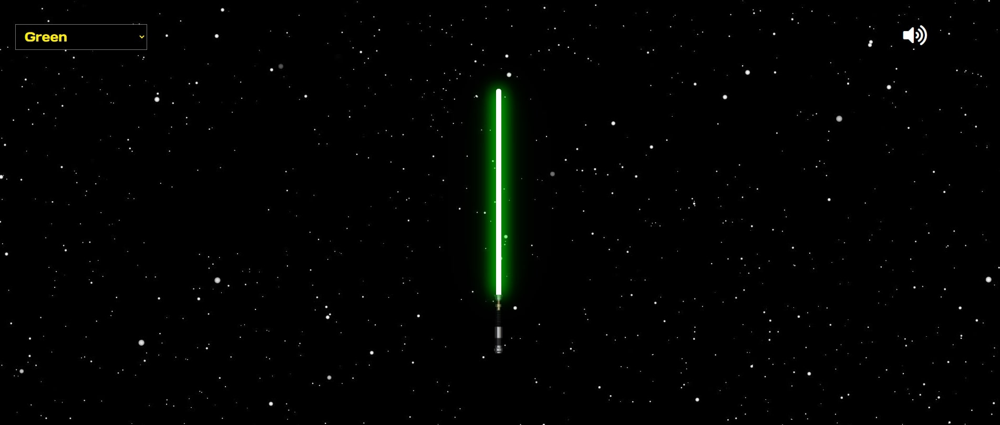

# lightsaber

CSS and Javascript lightsaber with sound

## Usage

1. Go to the [site](https://kasperofzeau.github.io/lightsaber/)
2. Choose a color in the select box in the upper left corner
3. Click on the lightsaber 
4. May the force be with you!

In the upper right concer you can mute the sound effects

## Authors

* **Kasper Beljaars** - *Project created* - [KasperOfzeau](https://github.com/KasperOfzeau)

## License

This project is licensed under the MIT License - see the [LICENSE.md](LICENSE.md) file for details

## Acknowledgments

* [Inspiration and help](https://youtu.be/CBw9-K6hYVA) - Youtube tutorial from [Kevin Powell](https://www.youtube.com/kepowob/videos)

